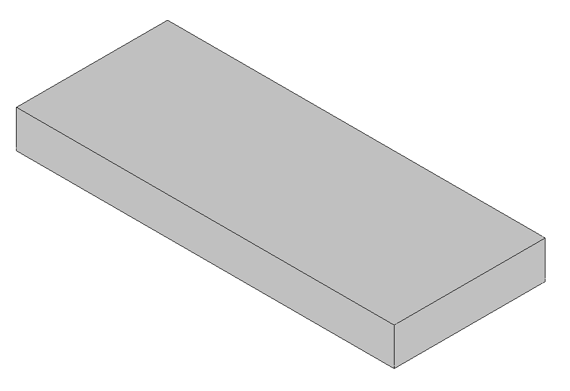
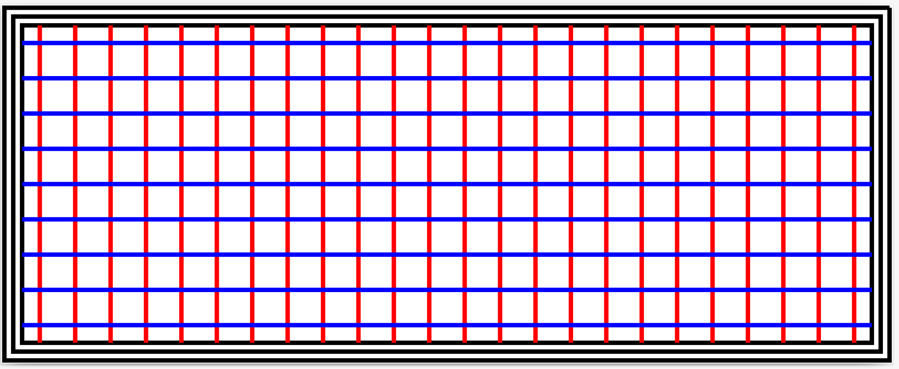

# Slicer Tutorial

This repository features a basic implementation of a slicer used in 3D printing to produce the print lines of the 3D printer to follow.





# Running the code

Use `python3 -m venv .venv` to create the virtual environment for the project.

https://docs.python.org/3/tutorial/venv.html

VSCode will default to the virtual env when you open the folder. Epic!


If you want to open and run on the command line then `cd` into the directory and run

```
# Linux/MacOS command
source .venv/bin/activate
```

which will activate the virtual environment.


To install the packages for the slicer, use

```
pip install -r requirements.txt
```

To run the example, enter:

```
python sample.py
```

You should see three figures appear in the out folder showing the incremental stages in producing the lines that are to be 3D printed for a single layer of a part. Creating the infill for an entire part is simply a matter of running a for loop incrementing across the layers that need to be sliced.

# Contributing

Black-with-tabs is included as a tool to maintain a consistent code format. Please run it before you commit any code to clean up any additions you make. It's great and save you a lot of time in not having to think about the formatting.

Simply run.

```
black .
```

The repo has also been set-out to be a single function per file with the folders representing the sub-modules in the slicer package. 

The purpose of this repo is to provide a tutorial to infill generation. It is not mean to be a production-ready infill generator. Eventhough a tutorial, the principles demonstrated have been used to develop infill topology optimisation strategies for loading and inertia by the Design Manufacturing Futures lab.
